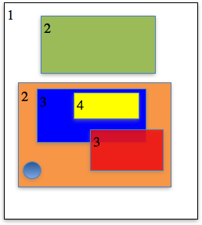
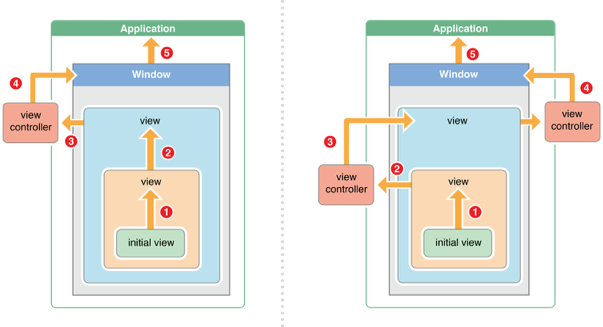

# UIView的触摸事件处理
- UIView是UIResponder的子类，可以覆盖下列4个方法处理不同的触摸事件

```objc
//一根或者多根手指开始触摸view，系统会自动调用view的下面方法
- (void)touchesBegan:(NSSet *)touches withEvent:(UIEvent *)event

//一根或者多根手指在view上移动，系统会自动调用view的下面方法（随着手指的移动，会持续调用该方法）
- (void)touchesMoved:(NSSet *)touches withEvent:(UIEvent *)event

//一根或者多根手指离开view，系统会自动调用view的下面方法
- (void)touchesEnded:(NSSet *)touches withEvent:(UIEvent *)event

//触摸结束前，某个系统事件(例如电话呼入)会打断触摸过程，系统会自动调用view的下面方法
- (void)touchesCancelled:(NSSet *)touches withEvent:(UIEvent *)event
提示：touches中存放的都是UITouch对象

```
</br>

- 当用户用一根手指触摸屏幕时，会创建一个与手指相关联的UITouch对象
一根手指对应一个UITouch对象

- UITouch的作用
保存着跟手指相关的信息，比如触摸的位置、时间、阶段，当手指移动时，系统会更新同一个UITouch对象，使之能够一直保存该手指在的触摸位置

- 当手指离开屏幕时，系统会销毁相应的UITouch对象

<font size = 5 color = red>提示：iPhone开发中，要避免使用双击事件！</font>

###UITouch的属性
```objc
//触摸产生时所处的窗口
@property(nonatomic,readonly,retain) UIWindow    *window;

//触摸产生时所处的视图
@property(nonatomic,readonly,retain) UIView      *view;

//短时间内点按屏幕的次数，可以根据tapCount判断单击、双击或更多的点击
@property(nonatomic,readonly) NSUInteger          tapCount;

//记录了触摸事件产生或变化时的时间，单位是秒
@property(nonatomic,readonly) NSTimeInterval      timestamp;

//当前触摸事件所处的状态
@property(nonatomic,readonly) UITouchPhase        phase;
```

###UITouch的方法
```objc
//返回值表示触摸在view上的位置
//这里返回的位置是针对view的坐标系的（以view的左上角为原点(0, 0)）
//调用时传入的view参数为nil的话，返回的是触摸点在UIWindow的位置
- (CGPoint)locationInView:(UIView *)view;

//该方法记录了前一个触摸点的位置
- (CGPoint)previousLocationInView:(UIView *)view;
```

###UIEvent
- 每产生一个事件，就会产生一个UIEvent对象

- UIEvent：称为事件对象，记录事件产生的<font size = 4 color = red>时刻</font>和<font size = 4 color = red>类型</font>

常见属性
事件类型
```objc
@property(nonatomic,readonly) UIEventType     type;
@property(nonatomic,readonly) UIEventSubtype  subtype;

//事件产生的时间
@property(nonatomic,readonly) NSTimeInterval  timestamp;
```
- UIEvent还提供了相应的方法可以获得在某个view上面的触摸对象（UITouch）

###一次完整的触摸过程，会经历3个状态：
```objc
//触摸开始：
- (void)touchesBegan:(NSSet *)touches withEvent:(UIEvent *)event
//触摸移动：
- (void)touchesMoved:(NSSet *)touches withEvent:(UIEvent *)event
//触摸结束：
- (void)touchesEnded:(NSSet *)touches withEvent:(UIEvent *)event
//触摸取消（可能会经历）
：- (void)touchesCancelled:(NSSet *)touches withEvent:(UIEvent *)event
```

- 根据touches中UITouch的个数可以判断出是单点触摸还是多点触摸

###事件的产生和传递
- 1、发生触摸事件后，系统会将该事件加入到一个由UIApplication管理的事件队列中

- 2、UIApplication会从事件队列中取出最前面的事件，并将事件分发下去以便处理，通常，先发送事件给应用程序的主窗口（keyWindow）

- 3、主窗口会在视图层次结构中找到一个最合适的视图来处理触摸事件，这也是整个事件处理过程的第一步

- 4、找到合适的视图控件后，就会调用视图控件的touches方法来作具体的事件处理</br>
touchesBegan…</br>
touchesMoved…</br>
touchedEnded…


###事件传递示例
触摸事件的传递是从父控件传递到子控件
- 点击了绿色的view：<br>
UIApplication -> UIWindow -> 白色 -> 绿色
- 点击了蓝色的view：<br>
UIApplication -> UIWindow -> 白色 -> 橙色 -> 蓝色
- 点击了黄色的view：<br>
UIApplication -> UIWindow -> 白色 -> 橙色 -> 蓝色 -> 黄色

<font size=5 color = red>如果父控件不能接收触摸事件，那么子控件就不可能接收到触摸事件(掌握)</font>

##如何找到最合适的控件来处理事件？(重点)
- 1、自己是否能接收触摸事件？
- 2、触摸点是否在自己身上？
- 3、从后往前遍历子控件，重复前面的两个步骤
- **如果没有符合条件的子控件，那么就自己最适合处理**
-
</br>

</br>

###UIView不接收触摸事件的三种情况
- 1、不接收用户交互</br>
userInteractionEnabled = NO

- 2、隐藏</br>
hidden = YES

- 3、透明</br>
alpha = 0.0 ~ 0.01

<font size = 4 color = red>提示：UIImageView的userInteractionEnabled默认就是NO，因此UIImageView以及它的子控件默认是不能接收触摸事件的</font>

###事件传递的时候调用hitTest函数
```objc
// 事件传递的时候调用
// 什么时候调用:当事件传递给控件的时候，就会调用控件的这个方法，去寻找最合适的view
// 作用：寻找最合适的view

// point：当前的触摸点，point这个点的坐标系就是方法调用者
（例如：是UIView 这个类调用的，那么point就是指UIView里面的点）
- (UIView *)hitTest:(CGPoint)point withEvent:(UIEvent *)event
{
    // 调用系统的做法去寻找最合适的view，返回最合适的view
    UIView *fitView = [super hitTest:point withEvent:event];

    return fitView;
}

// 作用：判断当前这个点在不在方法调用者（控件）上
- (BOOL)pointInside:(CGPoint)point withEvent:(UIEvent *)event

- (void)touchesBegan:(NSSet *)touches withEvent:(UIEvent *)event

// 当前坐标系上的点转换到按钮上的点
CGPoint btnP = [self convertPoint:point toView:self.btn];
```
</br>
<font size = 6 color = red>触摸事件处理的详细过程</font>

- #### 用户点击屏幕后产生的一个触摸事件，经过一系列的传递过程后，会找到最合适的视图控件来处理这个事件(用hitTest来找)

- #### 找到最合适的视图控件后，就会调用控件的touches方法来作具体的事件处理</br>touchesBegan…</br>touchesMoved…</br>touchedEnded…

- #### 这些touches方法的<font size = 4, color = red>默认做法</font>是将事件顺着<font size = 4, color = red>响应者链条</font>向上传递，将事件交给上一个响应者进行处理

</br>
###响应者链条示意图
- 响应者链条：是由多个响应者对象连接起来的链条
- 作用：能很清楚的看见每个响应者之间的联系，并且可以让一个事件多个对象处理。
- 响应者对象：能处理事件的对象

###响应者链的事件传递过程
- 1、如果view的控制器存在，就传递给控制器；如果控制器不存在，则将其传递给它的父视图
- 2、在视图层次结构的最顶级视图，如果也不能处理收到的事件或消息，则其将事件或消息传递给window对象进行处理
- 3、如果window对象也不处理，则其将事件或消息传递给UIApplication对象
- 4、如果UIApplication也不能处理该事件或消息，则将其丢弃

</br>

<font size = 6, color = red>事件传递的完整过程</font>
- ####1、 先将事件对象由上往下传递(由父控件传递给子控件)，找到最合适的控件来处理这个事件。

- ####2、 调用最合适控件的touches….方法

- ####3、  如果调用了[super touches….];就会将事件顺着响应者链条往上传递，传递给上一个响应者
 - ####4、接着就会调用上一个响应者的touches….方法

####如何判断上一个响应者
- 1、如果当前这个view是控制器的view,那么控制器就是上一个响应者
- 2、如果当前这个view不是控制器的view,那么父控件就是上一个响应者

###如果想监听一个view上面的触摸事件
- 1 、<font size = 4, color = red>自定义一个view</font>
- 2 、实现view的touches方法，在方法内部实现具体处理代码
