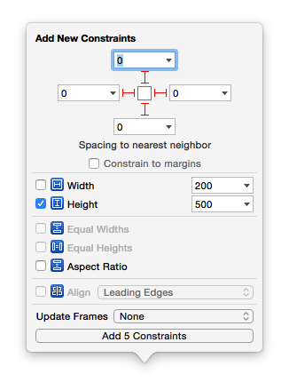

## 修改UITextField的光标颜色
```objc
textField.tintColor = [UIColor whiteColor];
```

## UITextField占位文字相关的设置
```objc
// 设置占位文字内容
@property(nullable, nonatomic,copy)   NSString               *placeholder;
// 设置带有属性的占位文字, 优先级 > placeholder
@property(nullable, nonatomic,copy)   NSAttributedString     *attributedPlaceholder;
```

## NSAttributedString
- 带有属性的字符串, 富文本
- 由2部分组成
    - 文字内容 : NSString *
    - 文字属性 : NSDictionary *
        - 文字颜色 - NSForegroundColorAttributeName
        - 字体大小 - NSFontAttributeName
        - 下划线 - NSUnderlineStyleAttributeName
        - 背景色 - NSBackgroundColorAttributeName
- 初始化

```objc
NSMutableDictionary *attributes = [NSMutableDictionary dictionary];
attributes[NSForegroundColorAttributeName] = [UIColor yellowColor];
attributes[NSBackgroundColorAttributeName] = [UIColor redColor];
attributes[NSUnderlineStyleAttributeName] = @YES;
NSAttributedString *string = [[NSAttributedString alloc] initWithString:@"123" attributes:attributes];
```
- 使用场合
    - UILabel - attributedText
    - UITextField - attributedPlaceholder

## NSMutableAttributedString
- 继承自NSAttributedString
- 常见方法

```objc
// 设置range范围的属性, 重复设置同一个范围的属性, 最后一次设置才是有效的(之前的设置会被覆盖掉)
- (void)setAttributes:(nullable NSDictionary<NSString *, id> *)attrs range:(NSRange)range;
// 添加range范围的属性, 同一个范围, 可以不断累加属性
- (void)addAttribute:(NSString *)name value:(id)value range:(NSRange)range;
- (void)addAttributes:(NSDictionary<NSString *, id> *)attrs range:(NSRange)range;
```

- 图文混排

```objc
UILabel *label = [[UILabel alloc] init];
label.frame = CGRectMake(100, 100, 200, 25);
label.backgroundColor = [UIColor redColor];
label.font = [UIFont systemFontOfSize:14];
[self.view addSubview:label];

// 图文混排
NSMutableAttributedString *attributedText = [[NSMutableAttributedString alloc] init];
// 1 - 你好
NSAttributedString *first = [[NSAttributedString alloc] initWithString:@"你好"];
[attributedText appendAttributedString:first];

// 2 - 图片
// 带有图片的附件对象
NSTextAttachment *attachment = [[NSTextAttachment alloc] init];
attachment.image = [UIImage imageNamed:@"header_cry_icon"];
CGFloat lineH = label.font.lineHeight;
attachment.bounds = CGRectMake(0, - ((label.xmg_height - lineH) * 0.5 - 1), lineH, lineH);
// 将附件对象包装成一个属性文字
NSAttributedString *second = [NSAttributedString attributedStringWithAttachment:attachment];
[attributedText appendAttributedString:second];

// 3 - 哈哈哈
NSAttributedString *third = [[NSAttributedString alloc] initWithString:@"哈哈哈"];
[attributedText appendAttributedString:third];

label.attributedText = attributedText;
```

- 一个Label显示多行不同字体的文字

```objc
UILabel *label = [[UILabel alloc] init];
// 设置属性文字
NSString *text = @"你好\n哈哈哈";
NSMutableAttributedString *attributedText = [[NSMutableAttributedString alloc] initWithString:text];
[attributedText addAttribute:NSFontAttributeName value:[UIFont systemFontOfSize:10] range:NSMakeRange(0, text.length)];
[attributedText addAttribute:NSFontAttributeName value:[UIFont boldSystemFontOfSize:13] range:NSMakeRange(3, 3)];
label.attributedText = attributedText;
// 其他设置
label.numberOfLines = 0;
label.textAlignment = NSTextAlignmentCenter;
label.frame = CGRectMake(0, 0, 100, 40);
[self.view addSubview:label];
self.navigationItem.titleView = label;
```

## 在storyboard\xib中给UIScrollView子控件添加约束
- 给添加一个UIView类型的子控件A(这将是UIScrollView唯一的一个子控件)
- 设置A距离UIScrollView上下左右间距都为0
- 往A中再添加其他子控件


- 上下滚动(垂直滚动)
    - 设置A的高度(这个高度就是UIScrollView的内容高度: contentSize.height)
    
    
    - 设置A在UIScrollView中左右居中(水平居中)

    
- 左右滚动(水平滚动)
    - 设置A的宽度(这个宽度就是UIScrollView的内容宽度: contentSize.width)


    - 设置A在UIScrollView中上下居中(垂直居中)

 
- 上下左右滚动(水平垂直滚动)
    - 设置A的宽度(这个宽度就是UIScrollView的内容宽度: contentSize.width)
    - 设置A的高度(这个高度就是UIScrollView的内容高度: contentSize.height)

   
    
    
    

## 修改UITextField占位文字的颜色
- 使用attributedPlaceholder

```objc
@property(nullable, nonatomic,copy)   NSAttributedString     *attributedPlaceholder;
```

- 重写- (void)drawPlaceholderInRect:(CGRect)rect;

```objc
- (void)drawPlaceholderInRect:(CGRect)rect;
```

- 修改内部占位文字Label的文字颜色

```objc
[textField setValue:[UIColor grayColor] forKeyPath:@"placeholderLabel.textColor"];
```

## 如何监听一个控件内部的事件
- 如果继承自UIControl

```objc
- (void)addTarget:(nullable id)target action:(SEL)action forControlEvents:(UIControlEvents)controlEvents;
```

- 代理

- 通知

- 利用内部的某些机制
    - 比如重写UITextField的`becomeFirstResponder`和`resignFirstResponder`来监听UITextField的获得焦点和失去焦点事件

## assign和weak的区别
- 本质区别
    - 速度比较: __unsafe_unretained > __weak

```objc
@property (nonatomic, assign) XMGDog *dog;  // XMGDog *__unsafe_unretained _dog;

__unsafe_unretained的特点:
1.不是强引用, 不能保住OC对象的命
2.如果引用的OC对象销毁了, 指针并不会被自动清空, 依然指向销毁的对象(很容易产生野指针错误: EXC_BAD_ACCESS)

@property (nonatomic, weak) XMGDog *dog;  // XMGDog * _Nullable __weak _dog;

__weak的特点:
1.不是强引用, 不能保住OC对象的命
2.如果引用的OC对象销毁了, 指针会被自动清空(变为nil), 不再指向销毁的对象(永远不会产生野指针错误)
```

- 用途
    - assign一般用在基本数据类型上面, 比如int\double等
    - weak一般用在代理对象上面, 或者用来解决循环强引用的问题

## 监听UITextField的获得焦点和失去焦点事件
- addTarget

```objc
[textField addTarget:target action:@selector(editingDidBegin) forControlEvents:UIControlEventEditingDidBegin];
[textField addTarget:target action:@selector(editingDidEnd) forControlEvents:UIControlEventEditingDidEnd];

UIControlEventEditingDidBegin
1.开始编辑
2.获得焦点
3.弹出键盘

UIControlEventEditingDidEnd
1.结束编辑
2.失去焦点
3.退下键盘
```

- delegate

```objc
textField.delegate = self;

#pragma mark - <UITextFieldDelegate>
- (void)textFieldDidBeginEditing:(UITextField *)textField
{

}

- (void)textFieldDidEndEditing:(UITextField *)textField
{

}
```

- 通知

```objc
[[NSNotificationCenter defaultCenter] addObserver:self selector:@selector(beginEditing) name:UITextFieldTextDidBeginEditingNotification object:textField];
[[NSNotificationCenter defaultCenter] addObserver:self selector:@selector(endEditing) name:UITextFieldTextDidEndEditingNotification object:textField];

- (void)dealloc
{
    [[NSNotificationCenter defaultCenter] removeObserver:self];
}

- (void)beginEditing
{

}

- (void)endEditing
{

}
```

- 重写UITextField的`becomeFirstResponder`和`resignFirstResponder`方法

```objc
/**
 *  调用时刻 : 成为第一响应者(开始编辑\弹出键盘\获得焦点)
 */
- (BOOL)becomeFirstResponder
{

    return [super becomeFirstResponder];
}

/**
 *  调用时刻 : 不做第一响应者(结束编辑\退出键盘\失去焦点)
 */
- (BOOL)resignFirstResponder
{

    return [super resignFirstResponder];
}
```

## 枚举值的某个规律
- 凡是使用了1 << n格式的枚举值, 都可以使用|进行组合使用

```objc
UIControlEventEditingDidBegin                                   = 1 << 16,
UIControlEventEditingChanged                                    = 1 << 17,
UIControlEventEditingDidEnd                                     = 1 << 18,
UIControlEventEditingDidEndOnExit                               = 1 << 19,

[textField addTarget:self action:@selector(test) forControlEvents:UIControlEventEditingDidBegin | UIControlEventEditingChanged];
```

## 通知相关的补充
### 使用block监听通知
```obj
// object对象发出了名字为name的通知, 就在queue队列中执行block
self.observer = [[NSNotificationCenter defaultCenter] addObserverForName:UITextFieldTextDidBeginEditingNotification object:self queue:[[NSOperationQueue alloc] init] usingBlock:^(NSNotification * _Nonnull note) {
    // 一旦监听到通知, 就会执行这个block中的代码
}];

// 最后需要移除监听
[[NSNotificationCenter defaultCenter] removeObserver:self.observer];
```

### 一次性通知(监听1次后就不再监听)
```objc
id observer = [[NSNotificationCenter defaultCenter] addObserverForName:UITextFieldTextDidBeginEditingNotification object:self queue:[[NSOperationQueue alloc] init] usingBlock:^(NSNotification * _Nonnull note) {


    // 移除通知
    [[NSNotificationCenter defaultCenter] removeObserver:observer];
}];
```

### 其他
```objc
dispatch_async(dispatch_get_global_queue(0, 0), ^{
    // 因为是在子线程注册了通知监听器, 所以beginEditing和endEditing会在子线程中执行
    [[NSNotificationCenter defaultCenter] addObserver:self selector:@selector(beginEditing) name:UITextFieldTextDidBeginEditingNotification object:self];
    [[NSNotificationCenter defaultCenter] addObserver:self selector:@selector(endEditing) name:UITextFieldTextDidEndEditingNotification object:self];
});
```


