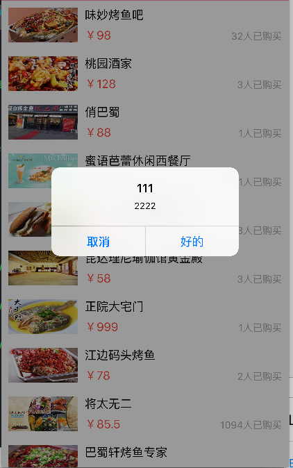
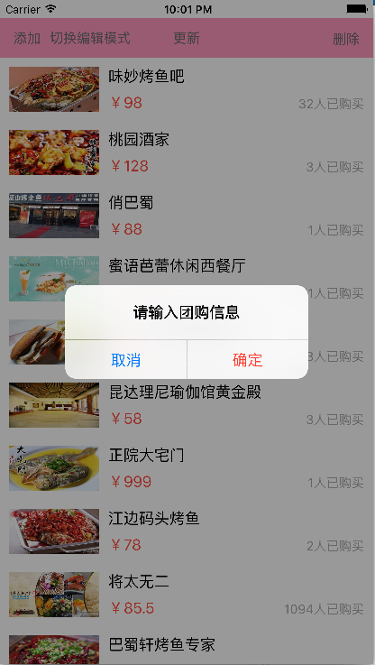
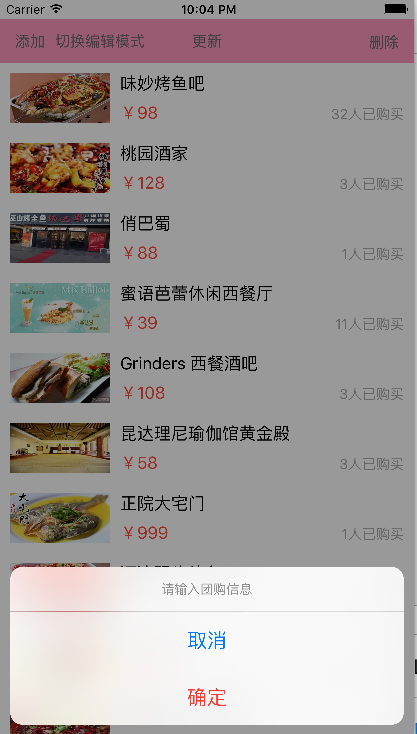

# UI对话框

##对话框
- 方法一
```objc
    UIAlertView *alertView = [[UIAlertView alloc] initWithTitle:@"111" message:@"2222" delegate:self cancelButtonTitle:@"取消" otherButtonTitles:@"好的", nil];

    [alertView show];
```


</br>
- 方法二

```objc
 // 创建弹框控制器
    UIAlertController *alert = [UIAlertController alertControllerWithTitle:@"请输入团购信息" message:nil preferredStyle:UIAlertControllerStyleAlert];

        [alert addAction:[UIAlertAction actionWithTitle:@"取消" style:UIAlertActionStyleDefault handler:^(UIAlertAction *action) {
        NSLog(@"点击了不知道按钮");
    }]];

    [alert addAction:[UIAlertAction actionWithTitle:@"确定" style:UIAlertActionStyleDestructive handler:^(UIAlertAction *action) {
        NSLog(@"点击了不知道2按钮");
    }]];

      // 显示控制器
    [self presentViewController:alert animated:YES completion:nil];
```

- 当preferredStyle =  UIAlertControllerStyleAlert 时
</br>


</br>
- 当preferredStyle =  UIAlertControllerStyleActionSheet 时
</br>


- 输入文本框时
```objc
   [alert addTextFieldWithConfigurationHandler:^(UITextField *textField) {
       textField.placeholder = @"请输入团购价格";
   }];
```
