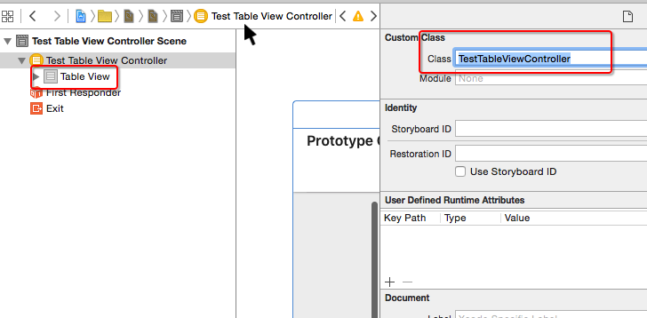

## frame和bounds的重新认识
- frame
    - 以`父控件` `内容`的左上角为坐标原点, 计算出的`控件自己` `矩形框`的位置和尺寸
- bounds
    - 以`控件自己` `内容`的左上角为坐标原点, 计算出的`控件自己` `矩形框`的位置和尺寸
- 概括
    - frame.size == bounds.size
    - scrollView.bounds.origin == scrollView.contentOffset

## bounds和frame的区别


## 矩形框和内容的理解
- 矩形框
    - 控件自己的显示位置和尺寸
- 内容
    - 控件内部的东西,比如它的子控件

## 在使用UITableViewController过程中,可能会出现的错误
```obj
@interface TestTableViewController : UITableViewController

@end

'-[UITableViewController loadView] instantiated view controller with identifier "UIViewController-BYZ-38-t0r" from storyboard "Main", but didn't get a UITableView.'
```
- 造成这个错误的原因
    - 错误地将一个UIViewController当做UITableViewController来用
- 错误做法


- 正确做法




## contentInset的调整
- 默认情况下, 如果一个控制器A处在导航控制器管理中, 并且控制器A的第一个子控件是UIScrollView, 那么就会自动调整这个UIScrollView的contentInset
    - UIEdgeInsetsMake(64, 0, 0, 0) // 有导航栏
    - UIEdgeInsetsMake(20, 0, 0, 0) // 没有导航栏
- 默认情况下, 如果一个控制器A处在导航控制器管理中, 并且导航控制器又处在UITabBarController管理中, 并且控制器A的第一个子控件是UIScrollView, 那么就会自动调整这个UIScrollView的contentInset
    - UIEdgeInsetsMake(64, 0, 49, 0)
- 如何禁止上述的默认问题?

```objc
控制器A.automaticallyAdjustsScrollViewInsets = NO;
```

## 文字内容换行
- 如何让storyboard\xib中的文字内容换行
    - 快捷键: option + 回车键
    - 在storyboard\xib输入\n是无法实现换行的
- 在代码中输入\n是可以实现换行的

```objc
self.label.text = @"534534534\n5345345\n5345";
```

## 修改状态栏样式
- 使用UIApplication来管理


```objc
[[UIApplication sharedApplication] setStatusBarStyle:UIStatusBarStyleLightContent];
```
在Info.plist中做了图中的配置,可能会出现以下警告信息


- 使用UIViewController来管理

```objc
@implementation XMGLoginRegisterViewController
- (UIStatusBarStyle)preferredStatusBarStyle
{
    return UIStatusBarStyleLightContent;
}
@end
```

## 在xib\storyboard中使用KVC

