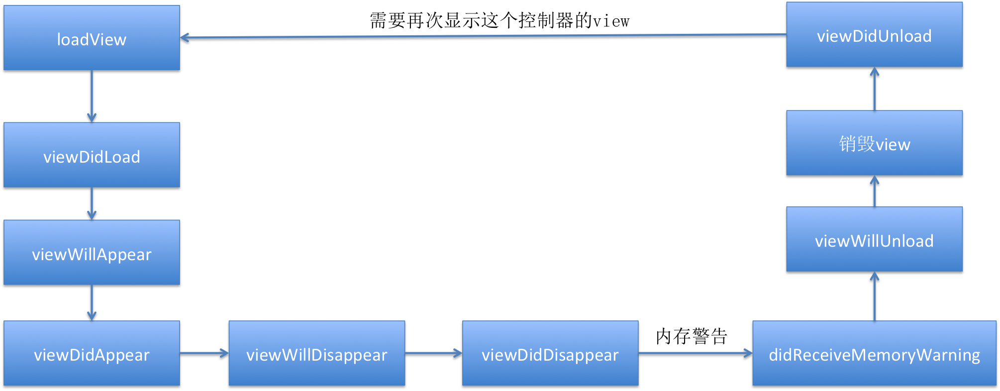

# AppDelegate

###控制器View的生命周期顺序



```objc
// 学习代理方法，只需要知道这个什么时候调用，这个方法可以用来干嘛

// 程序启动完成的时候调用
- (BOOL)application:(UIApplication *)application didFinishLaunchingWithOptions:(NSDictionary *)launchOptions {
    // Override point for customization after application launch.
    NSLog(@"%s",__func__);
    return YES;
}

// 当app失去焦点的时候调用
- (void)applicationWillResignActive:(UIApplication *)application {
        NSLog(@"%s",__func__);
    // Sent when the application is about to move from active to inactive state. This can occur for certain types of temporary interruptions (such as an incoming phone call or SMS message) or when the user quits the application and it begins the transition to the background state.
    // Use this method to pause ongoing tasks, disable timers, and throttle down OpenGL ES frame rates. Games should use this method to pause the game.
}

// app进入后台的时候调用
// app忽然打断的时候，在这里保存一些需要用到的数据
- (void)applicationDidEnterBackground:(UIApplication *)application {
        NSLog(@"%s",__func__);
    // Use this method to release shared resources, save user data, invalidate timers, and store enough application state information to restore your application to its current state in case it is terminated later.
    // If your application supports background execution, this method is called instead of applicationWillTerminate: when the user quits.
}


// app进入即将前台
- (void)applicationWillEnterForeground:(UIApplication *)application {
        NSLog(@"%s",__func__);
    // Called as part of the transition from the background to the inactive state; here you can undo many of the changes made on entering the background.
}

// 当app获取到焦点的时候调用，意味着app可以与用户交互
- (void)applicationDidBecomeActive:(UIApplication *)application {
        NSLog(@"%s",__func__);
    // Restart any tasks that were paused (or not yet started) while the application was inactive. If the application was previously in the background, optionally refresh the user interface.
}

// app被关闭的时候调用
- (void)applicationWillTerminate:(UIApplication *)application {
        NSLog(@"%s",__func__);
    // Called when the application is about to terminate. Save data if appropriate. See also applicationDidEnterBackground:.
}


// app接收到内存警告的时候调用
// 清空图片的缓存
- (void)applicationDidReceiveMemoryWarning:(UIApplication *)application
{
    NSLog(@"%s",__func__);
}

```

###UIApplication
- 1、在哪设置UIApplication的代理,需要了解ios程序的启动过程.
   -  创建application,创建并且设置application的代理
   -  开启事件循环,不断监听事件。如果产生系统事件,就会通知代理,其他事件,会找到一个最合适的视图处理事件。 2.3>只有应用程序关闭,才会结束程序
- 2、UIApplicationMain函数:PPT演示
  * 注意UIApplicationMain函数会开启一个事件循环,并不会马上就执行完
毕。
  * 底层做的事情,创建UIApplication对象和UIApplicationDelegate对象,设置
UIApplication的代理,开启事件循环,监听系统事件。
 - delegateClassName不能传nil,这里传nil,意味着application没有 代理,就无法监听系统的事件,系统的事件都没法监听,窗口都不知道 什么时候去加载,因为视图都是懒加载的,因此就不会创建窗口,什么 东西都没有。
 - principalClassName传nil,默认是UIApplication,创建一个 UIApplication对象。
- 3、UIApplication代理的作用:处理系统事件,不是任何事件都交给他处理,按 钮点击,屏幕点击都不是他处理,是由UIApplication处理。
 - 加载完成,初始化的操作
 - 进入后台:一般在这里保存应用的数据(游戏数据,比如暂停游戏) 2.3>内存警告:清空不必要的内容

```objc
UIApplicationMain(int argc, char *argv[], NSString * __nullable principalClassName, NSString * __nullable delegateClassName);

        // principalClassName 填nil就是填:@"UIApplication"
        // 字符串转类名 NSClassFromString(@"UIApplication")
        // 第三个参数：UIApplication
        // 第四个参数：AppDelegate：必须要遵守UIApplicationDelegate协议
        return UIApplicationMain(argc, argv, nil,NSStringFromClass([AppDelegate class]));
```

###UIApplicationMain底层实现
- 1、根据principalClassName提供类名创建UIApplication对象
- 2、创建UIApplicationDelegate对象，并且成为UIApplication对象代理，app.delegate = delegate
- 3、开启一个主运行循环，处理事件，可以保持程序一直运行。
- 4、加载info.plist，并且判断有木有指定main.storyboard,如果指定，就会去加载
  - 根据Info.plist获得最主要storyboard的文件名,加载最主要的storyboard(如果有storyboard)
    - 创建UIWindow
    - 创建和设置UIWindow的rootViewController
    - 显示窗口
