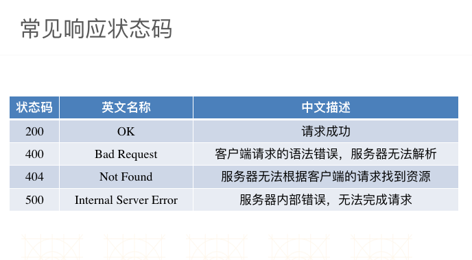

# Http

###HTTP通信过程 - 请求
- 请求头：包含了对客户端的环境描述、客户端请求信息等
- GET /minion.png HTTP/1.1   // 包含了请求方法、请求资源路径、HTTP协议版本
- Host: 120.25.226.186:32812 	// 客户端想访问的服务器主机地址
- User-Agent: Mozilla/5.0  // 客户端的类型，客户端的软件环境
- Accept: text/html, */* 	// 客户端所能接收的数据类型
- Accept-Language: zh-cn 	// 客户端的语言环境
- Accept-Encoding: gzip 	// 客户端支持的数据压缩格式
- 请求体：客户端发给服务器的具体数据，比如文件数据(POST请求才会有)

###客户端向服务器发送请求，服务器应当做出响应，即返回数据给客户端
- HTTP协议规定：1个完整的HTTP响应中包含以下内容
- 响应头：包含了对服务器的描述、对返回数据的描述
- HTTP/1.1 200 OK            // 包含了HTTP协议版本、状态码、状态英文名称
- Server: Apache-Coyote/1.1 		// 服务器的类型
- Content-Type: image/jpeg 		// 返回数据的类型
- Content-Length: 56811 		// 返回数据的长度
- Date: Mon, 23 Jun 2014 12:54:52 GMT	// 响应的时间

响应体：服务器返回给客户端的具体数据，比如文件数据

