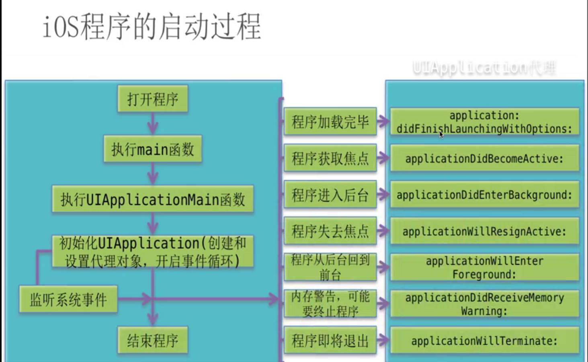

# IOS 的启动过程

###UIApplicationMain底层实现
- 1、根据principalClassName提供类名创建UIApplication对象
- 2、创建UIApplicationDelegate对象，并且成为UIApplication对象代理，app.delegate = delegate
- 3、开启一个主运行循环，处理事件，可以保持程序一直运行。
- 4、加载info.plist，并且判断有木有指定main.storyboard,如果指定，就会去加载
  - 根据Info.plist获得最主要storyboard的文件名,加载最主要的storyboard(如果有storyboard)
    - 创建UIWindow
    - 创建和设置UIWindow的rootViewController
    - 显示窗口

 

