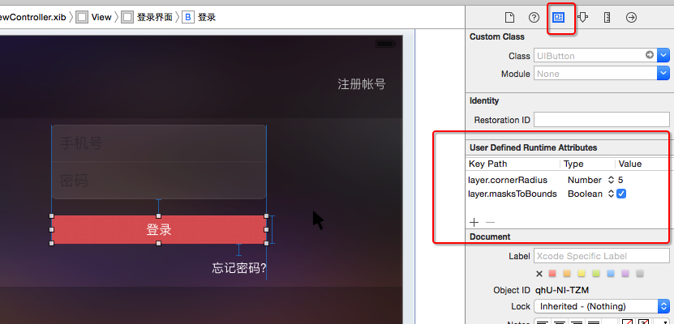

# IOS 设置圆角
##方法一
```objc
    self.loginBtn.layer.cornerRadius = 5;
    self.loginBtn.layer.masksToBounds = YES;
    
    serhead.layer.masksToBounds = YES;  
    userhead.layer.cornerRadius = 6.0;  
    userhead.layer.borderWidth = 1.0;  
    userhead.layer.borderColor = [[UIColor whiteColor] CGColor];  
```

##方法二
```objc
    [self.loginBtn setValue:@5 forKeyPath:@"layer.cornerRadius"];
    [self.loginBtn setValue:@YES forKeyPath:@"layer.masksToBounds"];
```

##方法三

