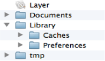

# iOS应用数据存储的常用方式

##iOS应用数据存储的常用方式

 - #### 1、XML属性列表（plist）归档
 - #### 2、Preference(偏好设置)
 - #### 4、SQLite3 
 - #### 5、Core Data

###应用沙盒
- 每个iOS应用都有自己的应用沙盒(应用沙盒就是文件系统目录)，与其他文件系统隔离。应用必须待在自己的沙盒里，其他应用不能访问该沙盒

 
 
应用程序包：(上图中的Layer)包含了所有的资源文件和可执行文件
- Documents：保存应用运行时生成的需要持久化的数据，iTunes同步设备时会备份该目录。例如，游戏应用可将游戏存档保存在该目录

- tmp：保存应用运行时所需的临时数据，使用完毕后再将相应的文件从该目录删除。应用没有运行时，系统也可能会清除该目录下的文件。iTunes同步设备时不会备份该目录

- Library/Caches：保存应用运行时生成的需要持久化的数据，iTunes同步设备时不会备份该目录。一般存储体积大、不需要备份的非重要数据

- Library/Preference：保存应用的所有偏好设置，iOS的Settings(设置)应用会在该目录中查找应用的设置信息。iTunes同步设备时会备份该目录

应用沙盒目录的常见获取方式