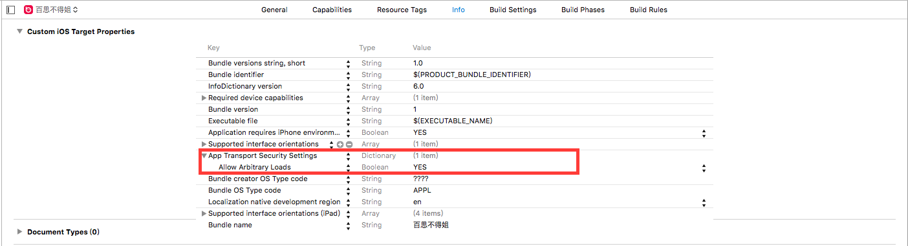

# 解决 App Transport Security 问题

```objc
NSAppTransportSecurity : Dictionary {
    NSExceptionDomains : Dictionary {
        <domain-name-string> : Dictionary {
            NSIncludesSubdomains : Boolean
            // Keys to describe your app’s intended network behavior for
            //    domains whose security attributes you control
            NSExceptionAllowsInsecureHTTPLoads : Boolean
            NSExceptionRequiresForwardSecrecy : Boolean
            NSExceptionMinimumTLSVersion : String
            // Keys to describe your app’s intended network behavior for
            //    domains whose security attributes you don't control
            NSThirdPartyExceptionAllowsInsecureHTTPLoads : Boolean
            NSThirdPartyExceptionRequiresForwardSecrecy : Boolean
            NSThirdPartyExceptionMinimumTLSVersion : String
        }
    }
    NSAllowsArbitraryLoads : Boolean
}
```

###添加如图所示


