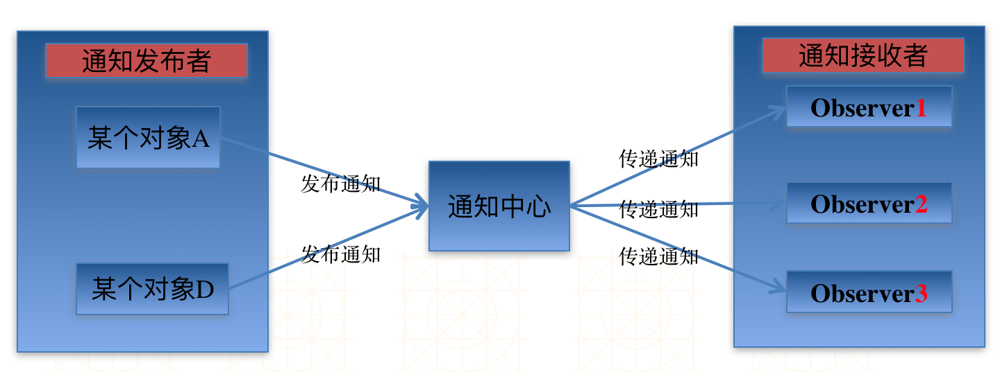

# Notification
##通知中心(NSNotificationCenter)
- 每一个应用程序都有一个通知中心(NSNotificationCenter)实例，专门负责协助不同对象之间的消息通信

- 任何一个对象都可以向通知中心发布通知(NSNotification)，描述自己在做什么。其他感兴趣的对象(Observer)可以申请在某个特定通知发布时(或在某个特定的对象发布通知时)收到这个通知



##常见的Notification属性和方法
```objc
- (NSString *)name; // 通知的名称
- (id)object; // 通知发布者(是谁要发布通知)
- (NSDictionary *)userInfo; // 一些额外的信息(通知发布者传递给通知接收者的信息内容)

初始化一个通知（NSNotification）对象
+ (instancetype)notificationWithName:(NSString *)aName object:(id)anObject;
+ (instancetype)notificationWithName:(NSString *)aName object:(id)anObject userInfo:(NSDictionary *)aUserInfo;
- (instancetype)initWithName:(NSString *)name object:(id)object userInfo:(NSDictionary *)userInfo;
```
##发布通知
- 通知中心(NSNotificationCenter)提供了相应的方法来帮助发布通知

```objc
- (void)postNotification:(NSNotification *)notification;
发布一个notification通知，可在notification对象中设置通知的名称、通知发布者、额外信息等

- (void)postNotificationName:(NSString *)aName object:(id)anObject;
发布一个名称为aName的通知，anObject为这个通知的发布者

- (void)postNotificationName:(NSString *)aName object:(id)anObject userInfo:(NSDictionary *)aUserInfo;
```
- 发布一个名称为aName的通知，anObject为这个通知的发布者，aUserInfo为额外信息

##接受通知(注册通知监听器)

- 通知中心(NSNotificationCenter)提供了方法来注册一个监听通知的监听器(Observer)

###方法一
```objc
- (void)addObserver:(id)observer selector:(SEL)aSelector name:(NSString *)aName object:(id)anObject;
```
###**参数解析**
- observer：监听器，即谁要接收这个通知
- aSelector：收到通知后，回调监听器的这个方法，并且把通知对象当做参数传入
- aName：通知的名称。如果为nil，那么无论通知的名称是什么，监听器都能收到这个通知
- anObject：通知发布者。如果为anObject和aName都为nil，监听器都收到所有的通知


###方法二
```objc
- (id)addObserverForName:(NSString *)name object:(id)obj queue:(NSOperationQueue *)queue usingBlock:(void (^)(NSNotification *note))block;
```
###**参数解析**
- name：通知的名称
- obj：通知发布者
- block：收到对应的通知时，会回调这个block
- queue：决定了block在哪个操作队列中执行，如果传nil，默认在当前操作队列中同步执行

##取消注册通知监听器</br>
###** (重点注意)对象注册通知监听器,必须在该对象释放前取消注册**
- 通知中心不会保留(retain)监听器对象，在通知中心注册过的对象，必须在该对象释放前取消注册。否则，当相应的通知再次出现时，通知中心仍然会向该监听器发送消息。因为相应的监听器对象已经被释放了，所以可能会导致应用崩溃

```objc
//通知中心提供了相应的方法来取消注册监听器
- (void)removeObserver:(id)observer;
- (void)removeObserver:(id)observer name:(NSString *)aName object:(id)anObject;

//一般在监听器销毁之前取消注册（如在监听器中加入下列代码）：
- (void)dealloc {
	//[super dealloc];  非ARC中需要调用此句
    [[NSNotificationCenter defaultCenter] removeObserver:self];
}
```

