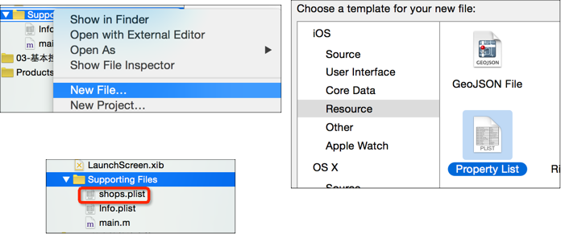
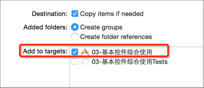
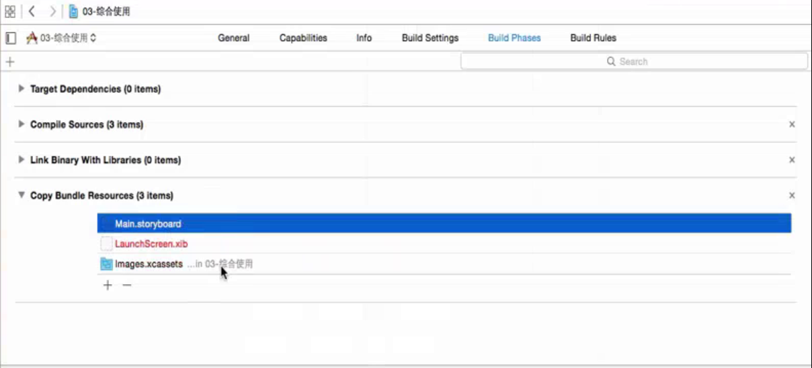

# plist
###创建Plist文件


- 接下来通过代码来解析Plist文件中的数据
获得Plist文件的全路径

```objc
NSBundle *bundle = [NSBundle mainBundle];
NSString *path = [bundle pathForResource:@"shops" ofType:@"plist"];

//加载plist文件
_shops = [NSArray arrayWithContentsOfFile:path];
```
### Plist的使用注意
- plist的文件名不能叫做“info”、“Info”之类的

- 添加plist等文件资源的时候，一定要勾选下面的选项



- 如果忘记勾选 add to targets (或者发现项目里有文件而编译到iPhone之后没有文件，就可能是忘记勾选 add to targets)


- 解决方法


