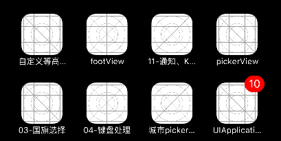

# UIApplication
###1、 什么是UIApplication
- UIApplication对象是应用程序的象征
- 每一个应用都有自己的UIApplication对象，而且是单例的
- 通过[UIApplication sharedApplication]可以获取这个单例对象
- 利用UIApplication对象，能进行一些应用级别的操作

###2.UIApplication的作用:做应用级别的操作
- 1、 设置应用图标右上角的数字,图标需要手动清除,应用程序关闭,不 会自动清除.
applicationIconBadgeNumber
- 2、显示联网状态,告诉用户此应用正在联网 networkActivityIndicatorVisible
- 3、打开一个资源
  - .URL:一个资源的唯一路径
  - 网络资源URL的组成==协议头://主机域名/路径 http://www.baidu.com/abc/1.png
  - 本地资源URL的组成==协议头:///路径 本机域名可以不写 file:///User/apple/Desktop/1.png
- 4、UIApplication打开资源的好处:不用判断用什么软件打开,系统会自动根据 协议头判断。
- 5、UIApplication管理状态栏
  - ios7默认交给控制器,需要配置下,不交给控制器管理,就会交个 UIApplication管理。
  - 动画隐藏状态栏
  - 动画设置状态栏样式

- 显示图标右上角的数字

```objc
    // 整个app中只有一个UIApplication，通过单例获取
    UIApplication *app = [UIApplication sharedApplication];

    // 2.UIApplication一般用来做一些应用级别的操作（app的提醒框，联网状态，打电话，打开网页，控制状态栏）
    // 设置appIcon提醒数字，必须注册用户通知
    app.applicationIconBadgeNumber = 10;
    // 创建用户通知
    UIUserNotificationSettings *settings = [UIUserNotificationSettings settingsForTypes:UIUserNotificationTypeBadge categories:nil];
    // 注册用户的通知
    [app registerUserNotificationSettings:settings];
```
<<<<<<< HEAD

=======
</br>
>>>>>>> 03d1f4cea6846c54a2214365ce194fe66dbef46f


```objc
// 设置联网状态
app.networkActivityIndicatorVisible = YES;
```


