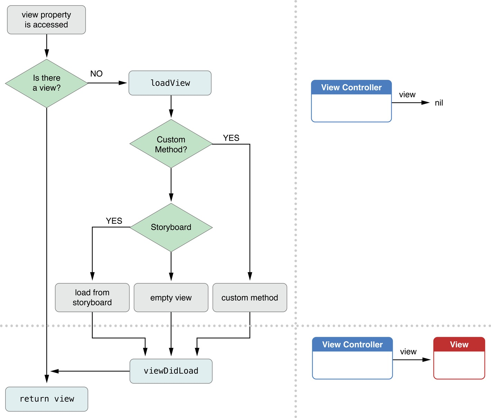

# ViewControl


<font color=red size=5 >特别注意：</font>
- 控制器的view是延迟加载的(就是懒加载)：用到时再加载

- 可以用isViewLoaded方法判断一个UIViewController的view是否已经被加载

- 控制器的view加载完毕就会调用viewDidLoad方法

###ViewController的view的创建


###控制器的View的加载


####1、 利用stroyboard 创建控制器
```objc
    //创建window
    self.window = [[UIWindow alloc] initWithFrame:[UIScreen mainScreen].bounds];

    // 通过storyboard创建控制器
    // 加载storyboard
    // storyboard文件名，不需要带后缀
    // nil:  [NSBundle mainBundle]
    UIStoryboard *storyboard = [UIStoryboard storyboardWithName:@"Main" bundle:nil];

     // instantiateInitialViewController：加载箭头指向的控制器
     // 创建UIViewController控制器，控制器的view并没有创建
    // 控制器的view懒加载：第一次使用的时候才会去加载，并不是创建UIViewController控制器的时候去加载
    UIViewController *viewControl = [storyboard instantiateInitialViewController];

    // 创建窗口的跟控制器
    self.window.rootViewController = viewControl;

    [self.window makeKeyAndVisible];
```

```objc
   //创建window
    self.window = [[UIWindow alloc] initWithFrame:[UIScreen mainScreen].bounds];

    // 通过storyboard创建控制器
    // storyboard文件名，不需要带后缀
    // nil:  [NSBundle mainBundle]
    UIStoryboard *storyboard = [UIStoryboard storyboardWithName:@"Main" bundle:nil];

     // instantiateInitialViewController：加载箭头指向的控制器
    UIViewController *viewControl = [storyboard instantiateViewControllerWithIdentifier:@"id"];

    // 创建窗口的跟控制器
    self.window.rootViewController = viewControl;

    [self.window makeKeyAndVisible];
```


####2、通过xib来创建控制器
```objc
    //创建window
    self.window = [[UIWindow alloc] initWithFrame:[UIScreen mainScreen].bounds];

    // 创建UIViewController控制器，控制器的view并没有创建
    // 控制器的view懒加载：第一次使用的时候才会去加载，并不是创建UIViewController控制器的时候去加载
    // 加载跟类名相同的xib
    // 如果描述控制器View的xib跟控制器的类名相同，就会去加载
    // 只有控制器的init方法底层会调用initWithNibName:bundle:
    // 只要通过initWithNibName:bundle:初始化控制器,并且nibName为nil,就会执行以下几步。
    // XMGViewController类型
    // 1.寻找有没有跟控制器类名同名但是不带Controller的xib，如果有就会去加载（XMGView.xib）
    // 2.寻找有没有跟控制器类名同名的xib，如果有就会去加载(XMGViewController.xib)
    // 3.如果都没有找到，创建空的view，
    UIViewController *vc = [[ViewController alloc] initWithNibName:@"VC" bundle:nil];

    self.window.rootViewController = vc;

    [self.window makeKeyAndVisible];
```
