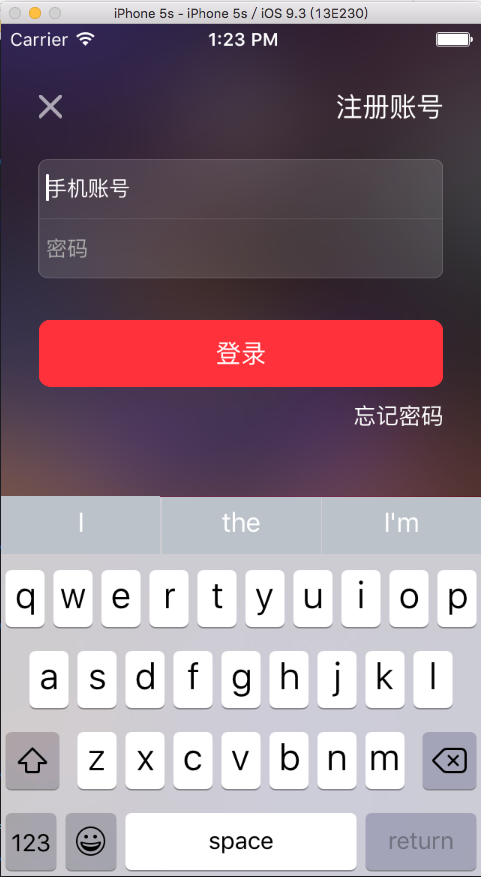

# 监听某个控件的行为（以UITextField为例）

###改变UITextField 占位字符的颜色

##知识点
## 修改UITextField的光标颜色
```objc
textField.tintColor = [UIColor whiteColor];
```

## UITextField占位文字相关的设置
```objc
// 设置占位文字内容
@property(nullable, nonatomic,copy)   NSString               *placeholder;
// 设置带有属性的占位文字, 优先级 > placeholder
@property(nullable, nonatomic,copy)   NSAttributedString     *attributedPlaceholder;
```

## NSAttributedString
- 带有属性的字符串, 富文本
- 由2部分组成
    - 文字内容 : NSString *
    - 文字属性 : NSDictionary *
        - 文字颜色 - NSForegroundColorAttributeName
        - 字体大小 - NSFontAttributeName
        - 下划线 - NSUnderlineStyleAttributeName
        - 背景色 - NSBackgroundColorAttributeName
- 初始化

```objc
NSMutableDictionary *attributes = [NSMutableDictionary dictionary];
attributes[NSForegroundColorAttributeName] = [UIColor yellowColor];
attributes[NSBackgroundColorAttributeName] = [UIColor redColor];
attributes[NSUnderlineStyleAttributeName] = @YES;
NSAttributedString *string = [[NSAttributedString alloc] initWithString:@"123" attributes:attributes];
```
- 使用场合
    - UILabel - attributedText
    - UITextField - attributedPlaceholder

- ###方法一 利用KVC来做
```objc
static NSString * const XMGPlaceholderColorKey = @"placeholderLabel.textColor";

 [self setValue:[UIColor grayColor] forKeyPath:XMGPlaceholderColorKey];
```

- ##方法二 利用NSAttributedString
```objc
   self.tintColor = [UIColor whiteColor];
    
    NSMutableDictionary *attributes = [NSMutableDictionary dictionary];
    
    //把占位字符颜色改为白色
    attributes[NSForegroundColorAttributeName] = [UIColor whiteColor];
    
    self.attributedPlaceholder  = [[NSAttributedString alloc] initWithString:self.placeholder attributes:attributes];
```

- ##监听某个控件的行为



- ###方法一（如果某个控件继承UIControl,如UITextField）
- 就利用控件本身有的addTarget

```objc
/**
 *  初始化
 */
- (void)setup
{
    self.tintColor = [UIColor whiteColor];
    
    [self changePlaceHolderColor:[UIColor lightGrayColor]];
    
    [self addTarget:self action:@selector(touchBegin) forControlEvents:UIControlEventEditingDidBegin];
    
    [self addTarget:self action:@selector(touchEnd) forControlEvents:UIControlEventEditingDidEnd];
}

/**
 *  点击UITextField
 */
- (void)touchBegin
{
    [self changePlaceHolderColor:[UIColor whiteColor]];
}

/**
 *  点击UITextField结束
 */
- (void)touchEnd
{
    [self changePlaceHolderColor:[UIColor lightGrayColor]];
}
```

- ###方法二（利用控件的代理方法）
- ##<font  color = red > 特别注意，如果利用代理的方法，可能会造成设置双重代理，导致其中一个代理失效</font>

```objc

- (void)setup
{
    self.tintColor = [UIColor whiteColor];
    
    [self changePlaceHolderColor:[UIColor lightGrayColor]];
    
    //控件设置了代理为自己，但是引用控件的控制器也有可能设置控件代理为控制器，设置了双重代理，只有一个代理有效
    self.delegate = self;
}

/**
 *  点击UITextField
 */
- (void)textFieldDidBeginEditing:(UITextField *)textField;
{
    [self changePlaceHolderColor:[UIColor whiteColor]];
}

/**
 *  点击UITextField结束
 */
- (void)textFieldDidEndEditing:(UITextField *)textField
{
    [self changePlaceHolderColor:[UIColor lightGrayColor]];
}

```

- ###方法三（利用通知Notification方法）

