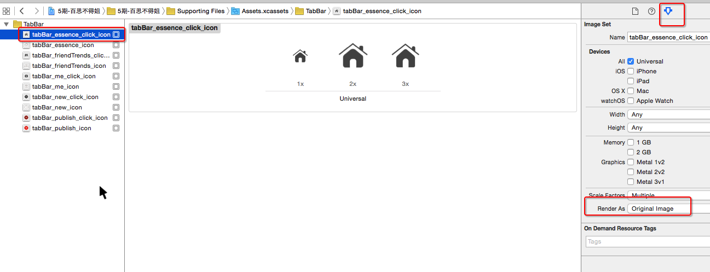

# TabBar配置、颜色说明和pch文件设置

## 从iOS9开始的常见报错
```objc
Application windows are expected to have a root view controller at the end of application launch
```
- 从iOS9开始, 在`程序启动完毕那一刻`显示出来的窗口`必须`要设置`根控制器`

## 应用程序的图标
- 旧项目中的图标只要符合1个条件即可
    - 图片名叫做Icon.png

## 有些图片显示出来会自动渲染成蓝色
#### 比如
- 设置tabBarItem的选中图片

```objc
vc.tabBarItem.selectedImage = image;
```

- 设置UIButtonTypeSystem样式按钮的image时

```objc
UIButton *btn = [UIButton buttonWithType:UIButtonTypeSystem];
[btn setImage:image forState:UIControlStateNormal];
```

#### 解决方案
- 再次产生一张不会进行渲染的图片

```objc
// 加载图片
UIImage *tempImage = [UIImage imageNamed:@"tabBar_essence_click_icon"];
// 产生一张不会进行自动渲染的图片
UIImage *selectedImage = [tempImage imageWithRenderingMode:UIImageRenderingModeAlwaysOriginal];
vc.tabBarItem.selectedImage = selectedImage;
```

- 直接在xcassets文件中配置



## 设置TabBarItem的文字属性
- 直接设置每一个tabBarItem对象

```objc
// 普通状态下的文字属性
NSMutableDictionary *normalAttrs = [NSMutableDictionary dictionary];
normalAttrs[NSFontAttributeName] = [UIFont systemFontOfSize:14];
normalAttrs[NSForegroundColorAttributeName] = [UIColor grayColor];
[vc.tabBarItem setTitleTextAttributes:normalAttrs forState:UIControlStateNormal];

// 选中状态下的文字属性
NSMutableDictionary *selectedAttrs = [NSMutableDictionary dictionary];
selectedAttrs[NSForegroundColorAttributeName] = [UIColor darkGrayColor];
[vc.tabBarItem setTitleTextAttributes:selectedAttrs forState:UIControlStateSelected];

// 字典中用到的key
1.iOS7之前(在UIStringDrawing.h中可以找到)
- 比如UITextAttributeFont\UITextAttributeTextColor
- 规律:UITextAttributeXXX

2.iOS7开始(在NSAttributedString.h中可以找到)
- 比如NSFontAttributeName\NSForegroundColorAttributeName
- 规律:NSXXXAttributeName
```

- 通过UITabBarItem的appearance对象统一设置

```objc
/**** 设置所有UITabBarItem的文字属性 ****/
UITabBarItem *item = [UITabBarItem appearance];
// 普通状态下的文字属性
NSMutableDictionary *normalAttrs = [NSMutableDictionary dictionary];
normalAttrs[NSFontAttributeName] = [UIFont systemFontOfSize:14];
normalAttrs[NSForegroundColorAttributeName] = [UIColor grayColor];
[item setTitleTextAttributes:normalAttrs forState:UIControlStateNormal];
// 选中状态下的文字属性
NSMutableDictionary *selectedAttrs = [NSMutableDictionary dictionary];
selectedAttrs[NSForegroundColorAttributeName] = [UIColor darkGrayColor];
[item setTitleTextAttributes:normalAttrs forState:UIControlStateSelected];
```

## 项目的图片资源
- 可以利用一个Mac软件解压
    - https://github.com/devcxm/iOS-Images-Extractor

## 颜色相关的一些知识
- 颜色的基本组成
    - 一种颜色由N个颜色通道组成
- 颜色通道
    - 1个颜色通道占据8bit
    - 1个颜色通道的取值范围
        - 10进制 : [0, 255]
        - 16进制 : [00, ff];
    - 常见的颜色通道
        - 红色 red R
        - 绿色 green G
        - 蓝色 blue B
        - 透明度 alpha A
    -  R\G\B一样的是灰色
- 颜色的种类
    - 24bit颜色
        - 由R\G\B组成的颜色
        - 常见的表示形式
            - 10进制(`仅仅是用在CSS`)
                - 红色 : rgb(255,0,0)
                - 绿色 : rgb(0,255,0)
                - 蓝色 : rgb(0,0,255)
                - 黄色 : rgb(255,255,0)
                - 黑色 : rgb(0,0,0)
                - 白色 : rgb(255,255,255)
                - 灰色 : rgb(80,80,80)
            - 16进制(`可以用在CSS\android`)
                - 红色 : #ff0000  #f00
                - 绿色 : #00ff00  #0f0
                - 蓝色 : #0000ff  #00f
                - 黄色 : #ffff00  #ff0
                - 黑色 : #000000  #000
                - 白色 : #ffffff  #fff
                - 灰色 : #979797
    - 32bit颜色
        - 由R\G\B\A组成的颜色
        - 常见的表示形式
            - 10进制(`仅仅是用在CSS`)
                - 红色 : rgba(255,0,0,255)
                - 绿色 : rgba(0,255,0,255)
                - 蓝色 : rgba(0,0,255,255)
                - 黄色 : rgba(255,255,0,255)
                - 黑色 : rgba(0,0,0,255)
                - 白色 : rgba(255,255,255,255)
            - 16进制(#AARRGGBB,  `仅仅是用在android`)
                - 红色 : #ffff0000
                - 绿色 : #ff00ff00
                - 蓝色 : #ff0000ff
                - 黄色 : #ffffff00
                - 黑色 : #ff000000
                - 白色 : #ffffffff

## PCH文件可能引发的错误

- 解决方案

```objc
#ifndef PrefixHeader_pch
#define PrefixHeader_pch

/*** 如果希望某些内容能拷贝到任何源代码文件(OC\C\C++等), 那么就不要写在#ifdef __OBJC__和#endif之间 ***/


/***** 在#ifdef __OBJC__和#endif之间的内容, 只会拷贝到OC源代码文件中, 不会拷贝到其他语言的源代码文件中 *****/
#ifdef __OBJC__


#endif
/***** 在#ifdef __OBJC__和#endif之间的内容, 只会拷贝到OC源代码文件中, 不会拷贝到其他语言的源代码文件中 *****/


#endif
```

## 在Build Setting中配置宏
- 如果项目中有些宏找不到, 可能是配置在Build Setting中


- 注意点:宏的名字不能全部是小写字母

- 如果宏的名字全部是小写, 会出现以下错误

