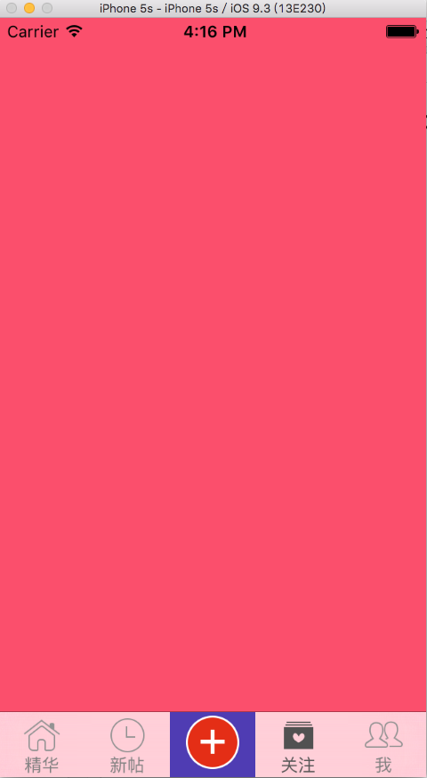

# TabBar中间按钮和Navigation常见配置

##TabBar中间按钮方法一

```objc
    //初始化
    [self setupTabBarChildrenWithTitle:@"精华" image:@"tabBar_essence_icon" selectImage:@"tabBar_essence_click_icon" viewController:[[UIViewController alloc] init]];
    
    [self setupTabBarChildrenWithTitle:@"新帖" image:@"tabBar_new_icon" selectImage:@"tabBar_new_click_icon" viewController:[[UIViewController alloc] init]];
    //重点是设置一个占位的控制器
    [self setupTabBarChildrenWithTitle:nil image:nil selectImage:nil viewController:[[UIViewController alloc] init]];
    
    [self setupTabBarChildrenWithTitle:@"关注" image:@"tabBar_me_icon" selectImage:@"tabBar_me_click_icon" viewController:[[UIViewController alloc] init]];
    
    [self setupTabBarChildrenWithTitle:@"我" image:@"tabBar_friendTrends_icon" selectImage:@"tabBar_friendTrends_click_icon" viewController:[[UIViewController alloc] init]];
```

```objc
//中间按钮懒加载
- (UIButton *)centerButton
{
    if (_centerButton == nil) {
        _centerButton = [UIButton buttonWithType:UIButtonTypeCustom];
        _centerButton.backgroundColor = XMGRandomColor;
        [_centerButton addTarget:self action:@selector(centerButtonClick) forControlEvents:UIControlEventTouchUpInside];
        [_centerButton setImage:[UIImage imageNamed:@"tabBar_publish_icon"] forState:UIControlStateNormal];
        [_centerButton setImage:[UIImage imageNamed:@"tabBar_publish_click_icon"] forState:UIControlStateHighlighted];
        _centerButton.frame = CGRectMake(0, 0, self.tabBar.frame.size.width / 5, self.tabBar.frame.size.height);
        _centerButton.center = CGPointMake(self.tabBar.frame.size.width / 2, self.tabBar.frame.size.height / 2);
        
    }
    return _centerButton;
}
```

```objc
/**
 *  初始化UITabBarControll
 *
 *  @param title       标题
 *  @param image       图片
 *  @param selectImage 被选择的图片
 *  @param vc          加入tabBar 的控制器
 */
- (void)setupTabBarChildrenWithTitle:(NSString *)title image:(NSString *)image selectImage:(NSString *)selectImage viewController :(UIViewController *) vc
{
    vc.tabBarItem.title = title;
    vc.view.backgroundColor = XMGRandomColor;
    if (image.length) {
        vc.tabBarItem.image = [UIImage imageNamed:image];
        vc.tabBarItem.selectedImage = [UIImage imageNamed:selectImage];
    }
    [self addChildViewController:vc];
    
}
```


