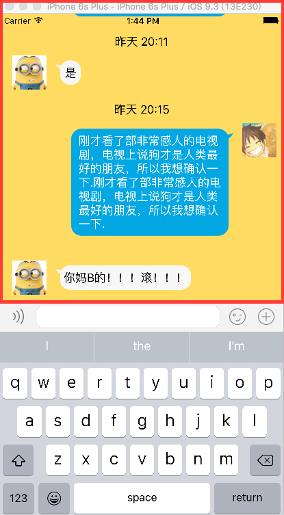
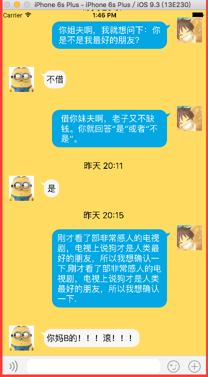

# UI键盘处理

##1.键盘的监听
- 一般来说，键盘的监听用通知来实现（NSNotificationCenter）

###方法一
- 同时监听键盘的显示和隐藏

```objc
//监听键盘的显示
[[NSNotificationCenter defaultCenter] addObserver:self selector:@selector(showKeyBoard:) name:UIKeyboardWillShowNotification object:nil];

//监听键盘的隐藏
[[NSNotificationCenter defaultCenter] addObserver:self selector:@selector(hideKeyBoard:) name:UIKeyboardWillHideNotification object:nil];
```

- 实现方法

```objc
- (void)showKeyBoard:(NSNotification * )note
{
    NSLog(@"%@",note.userInfo);

    //界面的底部约束，[note.userInfo[UIKeyboardFrameEndUserInfoKey] CGRectValue].size.height 键盘最终的frame(动画执行完毕后)
    self.chatButtonCon.constant = [note.userInfo[UIKeyboardFrameEndUserInfoKey] CGRectValue].size.height;


    //键盘弹出的时间
    CGFloat duration = [note.userInfo[UIKeyboardAnimationDurationUserInfoKey] doubleValue];

    //键盘弹出动画
    [UIView animateWithDuration:duration animations:^{
        [self.view layoutIfNeeded];
    }];
}

- (void)hideKeyBoard:(NSNotification * )note
{

    //界面的底部约束
    self.chatButtonCon.constant = 0;

    //键盘弹出的时间
    CGFloat duration = [note.userInfo[UIKeyboardAnimationDurationUserInfoKey] doubleValue];

    //键盘弹出动画
    [UIView animateWithDuration:duration animations:^{
        [self.view layoutIfNeeded];
    }];

}

```

###方法二
- 注册监听器
```bjco
  [[NSNotificationCenter defaultCenter] addObserver:self selector:@selector(changeKeyBoard:) name:UIKeyboardWillChangeFrameNotification object:nil];
```
- 注意是取出 UIKeyboardAnimationDurationUserInfoKey的origin的Y值

```objc
- (void)changeKeyBoard:(NSNotification * )note
{
    CGFloat height = [UIScreen mainScreen].bounds.size.height - [note.userInfo[UIKeyboardFrameEndUserInfoKey] CGRectValue].origin.y;

    CGFloat duration = [note.userInfo[UIKeyboardAnimationDurationUserInfoKey] doubleValue];

    self.view.transform = CGAffineTransformMakeTranslation(0, -height);

    [UIView animateWithDuration:duration animations:^{

        [self.view layoutIfNeeded];
    }];
}
```

###取消键盘（textfiled）(3个方法)
```objc
1、[self.textfiled resignFirstResponder]
2、[self.textfiled endEditing:YES]
2、[self.view endEditing:YES]
```

###注意
- 键盘显示的时候 [note.userInfo[UIKeyboardFrameEndUserInfoKey] CGRectValue].size.height 的值为图红的高度



</br>
- 键盘隐藏的时候 [note.userInfo[UIKeyboardFrameEndUserInfoKey] CGRectValue].size.height 的值为图红的高度




###通知传递下来的  (NSNotification * )note 对象的 userInfo
note.userInfo
```objc
    UIKeyboardAnimationCurveUserInfoKey = 7;
    UIKeyboardAnimationDurationUserInfoKey = "0.25";
    UIKeyboardBoundsUserInfoKey = "NSRect: {{0, 0}, {414, 271}}";
    UIKeyboardCenterBeginUserInfoKey = "NSPoint: {207, 871.5}";
    UIKeyboardCenterEndUserInfoKey = "NSPoint: {207, 600.5}";
    UIKeyboardFrameBeginUserInfoKey = "NSRect: {{0, 736}, {414, 271}}";
    UIKeyboardFrameEndUserInfoKey = "NSRect: {{0, 465}, {414, 271}}";
    UIKeyboardIsLocalUserInfoKey = 1;</br>
```

```objc
系统发出键盘通知时,会附带一下跟键盘有关的额外信息(字典),字典常见的key如下:
UIKeyboardFrameBeginUserInfoKey // 键盘刚开始的frame
UIKeyboardFrameEndUserInfoKey // 键盘最终的frame(动画执行完毕后)
UIKeyboardAnimationDurationUserInfoKey // 键盘动画的时间
UIKeyboardAnimationCurveUserInfoKey // 键盘动画的执行节奏(快慢)
```

