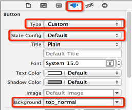

# UIButton
##UIButton的状态
- normal（普通状态）
 - 默认情况（Default）
 - 对应的枚举常量：UIControlStateNormal


- highlighted（高亮状态)
 - 按钮被按下去的时候（手指还未松开)
 - 对应的枚举常量：UIControlStateHighlighted


- disabled（失效状态，不可用状态)
 - 如果enabled属性为NO，就是处于disable状态，代表按钮不可以被点击
 - 对应的枚举常量：UIControlStateDisabled

* 设置按钮在不同状态下的背景图片
（为了保证高亮状态下的图片正常显示，必须设置按钮的type为custom）



### 在用代码创建按钮的同时指定按钮样式
```objc
UIButton *btn = [UIButton buttonWithType:UIButtonTypeCustom];
UIButtonTypeCustom：无类型，按钮的内容需要自定义
UIButtonTypeDetailDisclosure：
UIButtonTypeInfoLight：
UIButtonTypeInfoDark：
UIButtonTypeContactAdd：
```

###UIButton的常见设置
* 特别注意，注意设置button颜色，标题，图片的时候一定要设置button状态

```objc
- (void)setTitle:(NSString *)title forState:(UIControlState)state;
//设置按钮的文字

- (void)setTitleColor:(UIColor *)color forState:(UIControlState)state;
//设置按钮的文字颜色

- (void)setImage:(UIImage *)image forState:(UIControlState)state;
//设置按钮内部的小图片

- (void)setBackgroundImage:(UIImage *)image forState:(UIControlState)state;
//设置按钮的背景图片

btn.titleLabel.font = [UIFont systemFontOfSize:13];

- (NSString *)titleForState:(UIControlState)state;
//获得按钮的文字

- (UIColor *)titleColorForState:(UIControlState)state;
//获得按钮的文字颜色

- (UIImage *)imageForState:(UIControlState)state;
//获得按钮内部的小图片

- (UIImage *)backgroundImageForState:(UIControlState)state;
//获得按钮的背景图片
```


