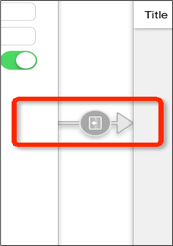
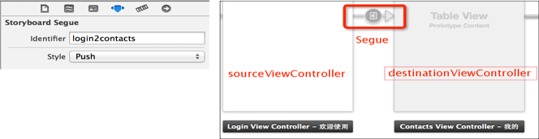
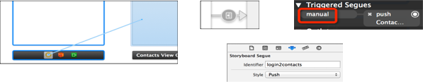

# UINavigationController

###1、UINavigationController的简单使用
- UINavigationController的使用步骤
 - 初始化UINavigationController
 - 设置UIWindow的rootViewController为UINavigationController
 - 根据具体情况，通过push方法添加对应个数的子控制器

## * UINavigationController以栈的形式保存子控制器</font>

```objc

@property(nonatomic,copy) NSArray *viewControllers;
@property(nonatomic,readonly) NSArray *childViewControllers;

//使用push方法能将某个控制器压入栈
- (void)pushViewController:(UIViewController *)viewController animated:(BOOL)animated;

//使用pop方法可以移除控制器
//将栈顶的控制器移除
- (UIViewController *)popViewControllerAnimated:(BOOL)animated;
//回到指定的子控制器
- (NSArray *)popToViewController:(UIViewController *)viewController animated:(BOOL)animated;
//回到根控制器（栈底控制器）
- (NSArray *)popToRootViewControllerAnimated:(BOOL)animated;
```

##控制器的数据传递
 - 控制器之间的数据传递主要有2种情况:顺传和逆传顺传
 - 顺传
  - 控制器的跳转方向: A -> C
  - 数据的传递方向    : A -> C
  - 数据的传递方式    :  在A的prepareForSegue:sender:方法中根据segue参数取得destinationViewController, 也就是控制器C, 直接给控制器C传递数据

```objc
- (void)prepareForSegue:(UIStoryboardSegue *)segue sender:(id)sender
{
    UIViewController  *c = segue.destinationViewController;
//拿到目标控制器，然后给目标的控制器传递数据
    c.navigationItem.title = [NSString stringWithFormat:@"%@通讯录",self.account.text];
}
```
- 逆传顺传
- 控制器的跳转方向: A -> C
- 数据的传递方向    : C -> A
- 数据的传递方式    :  让A成为C的代理,
- 在C中调用A的代理方法,通过代理方法的参数传递数据给A

```objc
// 跳转之前的时候调用
@protocol XMGAddViewControllerDelegate <NSObject>

@optional
- (void)addViewController:(XMGAddViewController *)addVc didClickAddBtnWithContact:(XMGContact *)contact;

@end

    // _delegate = _contactVc
    if ([_delegate respondsToSelector:@selector(addViewController:didClickAddBtnWithContact:)]) {
        [_delegate addViewController:self didClickAddBtnWithContact:c];
    }

- (void)prepareForSegue:(UIStoryboardSegue *)segue sender:(id)sender
{

    // 给添加控制器传递联系人控制器属性
    XMGAddViewController *addVc = segue.destinationViewController;

    addVc.delegate = self;
}

- (void)addViewController:(XMGAddViewController *)addVc didClickAddBtnWithContact:(XMGContact *)contact
{
    // 把添加界面的联系人模型传递到联系人界面

    // 把联系人模型保存到数组
    [self.contacts addObject:contact];

    // 刷新表格
    [self.tableView reloadData];

```

###利用block来传输数据
```objc
{
    ZJCAddVeiw *c = segue.destinationViewController;

        c.block = ^(ZJCChatData * data)
        {
            [self.array addObject:data];

            [self.tableView reloadData];
        };
}

//定义block
typedef void(^ZJCAddVeiwBlock)(ZJCChatData * data);

@property (nonatomic,copy) ZJCAddVeiwBlock block;

- (IBAction)recond:(id)sender {
    ZJCChatData *data = [[ZJCChatData alloc] init];
    data.name = self.name.text;
    data.tel = self.tel.text;

    if (self.block) {
        self.block(data);
    }

    [self.navigationController popViewControllerAnimated:YES];
}
```

##修改导航栏的内容
## * 导航栏的内容由栈顶控制器的navigationItem属性决定</font>

```objc
//UINavigationItem有以下属性影响着导航栏的内容
//左上角的返回按钮
@property(nonatomic,retain) UIBarButtonItem *backBarButtonItem;
//中间的标题视图
@property(nonatomic,retain) UIView          *titleView;
//中间的标题文字
@property(nonatomic,copy)   NSString        *title;
//左上角的视图
@property(nonatomic,retain) UIBarButtonItem *leftBarButtonItem;
//UIBarButtonItem *rightBarButtonItem  右上角的视图
@property(nonatomic,retain) UIBarButtonItem *rightBarButtonItem;
```

##Segue
- Storyboard上每一根用来界面跳转的线，都是一个UIStoryboardSegue对象（简称Segue）

 


- Segue的三个属性
```objc
//唯一标识
@property (nonatomic, readonly) NSString *identifier;
//来源控制器
@property (nonatomic, readonly) id sourceViewController;
//目标控制器
@property (nonatomic, readonly) id destinationViewController;
```


####自动型Segue
  - 按住Control键，直接从控件拖线到目标控制器

**如果点击某个控件后，不需要做任何判断，一定要跳转到下一个界面，建议使用“自动型Segue”**

手动型Segue
- 按住Control键，从来源控制器拖线到目标控制器
- 手动型的Segue需要设置一个标识（如右图）
- 在恰当的时刻，使用perform方法执行对应的Segue

```objc
// Segue必须由来源控制器来执行，也就是说，这个perform方法必须由来源控制器来调用

[self performSegueWithIdentifier:@"login2contacts" sender:nil];
```
- 如果点击某个控件后，需要做一些判断，也就是说：满足一定条件后才跳转到下一个界面，建议使用“手动型Segue”

 

####除了push之外，还有另外一种控制器的切换方式，那就是Modal

- 任何控制器都能通过Modal的形式展示出来

- Modal的默认效果：新控制器从屏幕的最底部往上钻，直到盖住之前的控制器为止

```objc
//以Modal的形式展示控制器
- (void)presentViewController:(UIViewController *)viewControllerToPresent animated: (BOOL)flag completion:(void (^)(void))completion

//关闭当初Modal出来的控制器
- (void)dismissViewControllerAnimated: (BOOL)flag completion: (void (^)(void))completion;
```

####接下来研究performSegueWithIdentifier:sender:方法的完整执行过程
- 1、根据identifier去storyboard中找到对应的线，新建UIStoryboardSegue对象
设置Segue对象的sourceViewController（来源控制器）
新建并且设置Segue对象的destinationViewController（目标控制器）
- 2、调用sourceViewController的下面方法，做一些跳转前的准备工作并且传入创建好的Segue对象

```objc
(void)prepareForSegue:(UIStoryboardSegue *)segue sender:(id)sender;
// 这个sender是当初performSegueWithIdentifier:sender:中传入的sender
```
- 3、调用Segue对象的-(void)perform;方法开始执行界面跳转操作
   - 如果segue的style是push，取得sourceViewController所在的UINavigationController调用UINavigationController的push方法将destinationViewController压入栈中，完成跳转
   - 如果segue的style是modal调用sourceViewController的presentViewController方法将destinationViewController展示出来

- 自定义navigation的图标

```objc
//自定义一个button
    UIButton *btn = [UIButton buttonWithType:UIButtonTypeCustom];
    [btn setImage:[UIImage imageNamed:@"navigationbar_friendsearch"] forState:UIControlStateNormal];
    [btn setImage:[UIImage imageNamed:@"navigationbar_friendsearch_highlighted"] forState:UIControlStateHighlighted];

//设置button的大小为图片大小
    [btn sizeToFit];
//left 为 left UIBarButtonItem
    self.left.customView = btn;
```

- 设置navigation的颜色

```objc
self.navigationController.navigationBar.barTintColor = [UIColor colorWithRed:0.809 green:0.491 blue:1.000 alpha:1.000];
```


