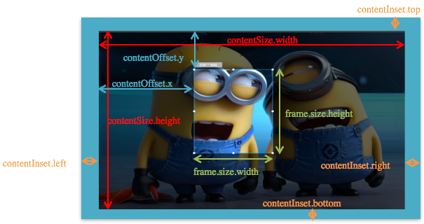
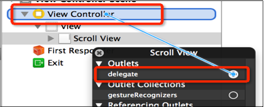

# uiscrollview

## UIScrollView的常见属性

```objc
@property(nonatomic) CGPoint contentOffset;
这个属性用来表示UIScrollView滚动的位置
（其实就是内容左上角与scrollView左上角的间距值）

@property(nonatomic) CGSize contentSize;
这个属性用来表示UIScrollView内容的尺寸，滚动范围（能滚多远）

@property(nonatomic) UIEdgeInsets contentInset;
这个属性能够在UIScrollView的4周增加额外的滚动区域，一般用来避免scrollView的内容被其他控件挡住
```

## UIScrollView无法滚动的解决办法
如果UIScrollView无法滚动，可能是以下原因：
* 没有设置contentSize
* scrollEnabled = NO
* 没有接收到触摸事件:userInteractionEnabled = NO


##UIScrollView的常见属性 实例图片


##UIScrollView 的代理（delegate）
```objc
// 用户开始拖拽时调用
- (void)scrollViewWillBeginDragging:(UIScrollView *)scrollView;
// 滚动到某个位置时调用
- (void)scrollViewDidScroll:(UIScrollView *)scrollView;
// 用户结束拖拽时调用
- (void)scrollViewDidEndDragging:(UIScrollView *)scrollView willDecelerate:(BOOL)decelerate;
```

- 一般情况下，就设置UIScrollView所在的控制器 为 UIScrollView的delegate
设置控制器为UIScrollView的delegate有2种方法：
通过代码（self就是控制器）
self.scrollView.delegate = self;
通过storyboard拖线（右击UIScrollView）



##UIScrollView的缩放原理
* 当用户在UIScrollView身上使用捏合手势时，UIScrollView会调用代理的viewForZoomingInScrollView:方法，这个方法返回的控件就是需要进行缩放的控件

* 要想实现缩放
 - 设置代理
 - 实现代理方法


* 设置UIScrollView的id<UISCrollViewDelegate> delegate代理对象
* 设置minimumZoomScale ：缩小的最小比例
* 设置maximumZoomScale ：放大的最大比例
* 让代理对象实现下面的方法，返回需要缩放的视图控件

```objc
- (UIView *)viewForZoomingInScrollView:(UIScrollView *)scrollView;
```

```objc
// 用户使用捏合手势时调用
- (UIView *)viewForZoomingInScrollView:(UIScrollView *)scrollView;
```


##UIScrollView的其他属性
```objc
@property(nonatomic) BOOL bounces;
设置UIScrollView是否需要弹簧效果

@property(nonatomic,getter=isScrollEnabled) BOOL scrollEnabled;
设置UIScrollView是否能滚动

@property(nonatomic) BOOL showsHorizontalScrollIndicator;
是否显示水平滚动条

@property(nonatomic) BOOL showsVerticalScrollIndicator;
是否显示垂直滚动条
```

