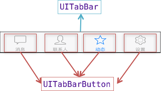
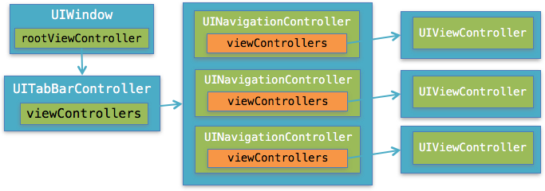

# UITabBarController


####UITabBarController的使用步骤
- 1、初始化UITabBarController
- 2、设置UIWindow的rootViewController为UITabBarController
- 3、根据具体情况，通过addChildViewController方法添加对应个数的子控制器


##### UITabBarController添加控制器的方式有2种
- 添加单个子控制器

```objc
- (void)addChildViewController:(UIViewController *)childController;
```

- 设置子控制器数组

```objc
@property(nonatomic,copy) NSArray *viewControllers;
```

###UITabBar
* 如果UITabBarController有N个子控制器，那么UITabBar内部就会有N个UITabBarButton作为子控件

* 如果UITabBarController有4个子控制器，那么UITabBar的结构大致如下图所示



###UITabBarButton里面显示什么内容，由对应子控制器的tabBarItem属性决定

UITabBarItem有以下属性影响着UITabBarButton的内容
```objc
//标题文字
@property(nonatomic,copy) NSString *title;

//图标
@property(nonatomic,retain) UIImage *image;

//选中时的图标
@property(nonatomic,retain) UIImage *selectedImage;

//提醒数字
@property(nonatomic,copy) NSString *badgeValue;
```

####代码生成
```objc
    //创建新window
    self.window = [[UIWindow alloc] init];

    //创建新UITabBarController
    UITabBarController *tab = [[UITabBarController alloc] init];

    UIViewController *c1 = [[UIViewController alloc] init];
    c1.view.backgroundColor = [UIColor colorWithRed:0.908 green:0.562 blue:1.000 alpha:1.000];
    c1.tabBarItem.title = @"聊天";
    c1.tabBarItem.image = [UIImage imageNamed:@"tab_me_nor"];

    UIViewController *c2 = [[UIViewController alloc] init];
    c2.view.backgroundColor = [UIColor blueColor];
    c2.tabBarItem.title = @"吃饭";
    c2.tabBarItem.image = [UIImage imageNamed:@"tab_qworld_nor"];


    //添加子控制器
    [tab addChildViewController:c1];
    [tab addChildViewController:c2];

    //window设置根控制器
    self.window.rootViewController = tab;

    //
    [self.window makeKeyAndVisible];
```

###App主流UI框架结构


