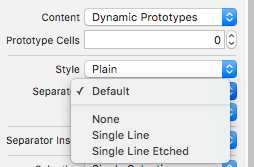
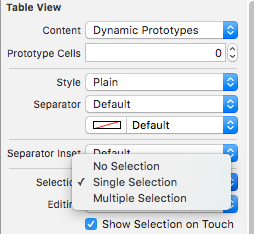

# UITableView setting
- 设置选中后的颜色


```objc
    UIView *view = [[UIView alloc] init];
    view.backgroundColor = [UIColor redColor];
    self.selectedBackgroundView = view;
```

- 设置分隔线

```objc
self.tableview.separatorStyle = UITableViewCellSeparatorStyleNone;
```
 </br></br>
**如果想自定义分割线，先把系统的分割线隐藏，然后添加一个UIView**
-

- 选择单行或者多行，或者不选择

```objc
//选择多行
self.tableview.allowsMultipleSelection = YES;

//选择单行
self.tableview.allowsSelection = YES;

//不选择
self.tableview.allowsSelection = NO;
```




- 点击变色，然后恢复状态

```objc
- (void)tableView:(UITableView *)tableView didSelectRowAtIndexPath:(NSIndexPath *)indexPath
{
    [tableView deselectRowAtIndexPath:indexPath animated:YES];
}
```
