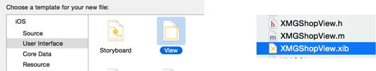
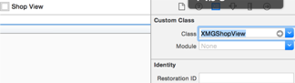
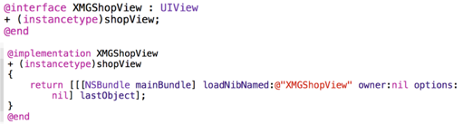

# view的封装
* 如果一个view内部的子控件比较多，一般会考虑自定义一个view，把它内部子控件的创建屏蔽起来，不让外界关心

* 外界可以传入对应的模型数据给view，view拿到模型数据后给内部的子控件设置对应的数据

封装控件的基本步骤
- 在initWithFrame:方法中添加子控件，提供便利构造方法
在layoutSubviews方法中设置子控件的frame（一定要调用super的layoutSubviews）
- 增加模型属性，在模型属性set方法中设置数据到子控件上

## 使用xib自定义view的步骤
1. 新建自定义控件类 

2. 新建xib文件（文件名建议和view的类名一致）

3. 修改xib中view的类名 

4. 封装xib的加载过程 

##注意点
- 一个控件有2种创建方式
通过代码创建
初始化时一定会调用initWithFrame:方法

- 通过xib\storyboard创建
初始化时不会调用initWithFrame:方法，只会调用initWithCoder:方法
初始化完毕后会调用awakeFromNib方法

- 有时候希望在控件初始化时做一些初始化操作，比如添加子控件、设置基本属性
这时需要根据控件的创建方式，来选择在initWithFrame:、initWithCoder:、awakeFromNib的哪个方法中操作

